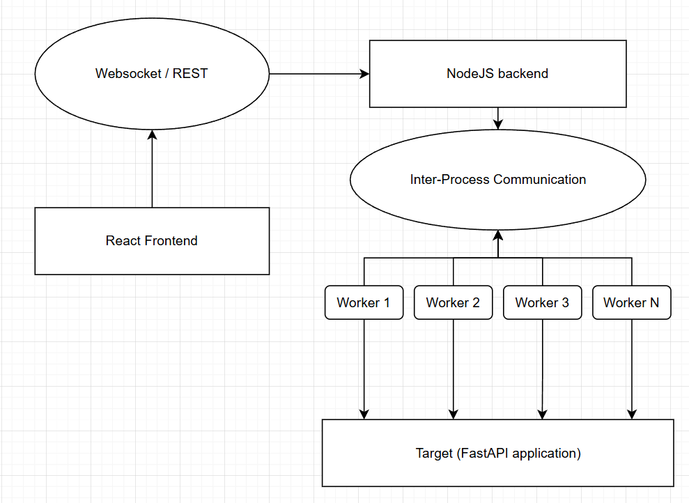

# SNA-Stress-Test-Tool

### Quick start

**Install dependencies**

`yarn install`

**Start server**

`yarn watch`

**Test server watch**

`yarn test-watch`

### Goal

The primary goal of this project is to develop an open-source distributed stress-testing (DDoS) tool for evaluating the resilience of backend systems under high-load and denial-of-service scenarios.
The tool is designed to simulate various types of network attacks, providing systematic means for assessing how backend infrastructures perform under extreme conditions. This helps developers and administrators to identify bottlenecks and improve system robustness.

### Main Tasks

- **Backend Development**
    - Develop a server-side application in TypeScript (Node.js).
    - Utilize Node.js Workers to parallelize traffic and maximize stress generation on target systems.
    - Use sockets for efficient inter-worker communication, allowing dynamic control of the simulated attack.

- **Frontend Development**
    - Build a React-based web interface which allows users to configure test parameters, launch attacks, and monitor the backend's resilience.
    - Enable real-time communication and configuration using sockets (for live updates) and REST API (Express.js) for management and data retrieval.

- **Testing & Validation**
    - Design and execute proof-of-concept attack scenarios targeting sample backend services to validate tool functionality.
    - Collect and analyze metrics related to both attack/load throughput and target response characteristics, presenting the results in a clear and interpretable format.

- **Documentation**
    - Prepare detailed setup instructions and user documentation.
    - Include links to source code repositories, configuration files, and usage examples for reproducibility and transparency.

### Architecture Overview

The solution consists of two main components:

- **Backend (attack generator)**:  
  A Node.js (TypeScript) server responsible for creating high network load using a pool of workers. Each worker acts as an independent client, generating and sending requests to the chosen target. Workers are controlled by the main process via sockets for real-time coordination and parameter update.

- **Frontend (control panel)**:  
  A React web application that communicates with the backend both through sockets (for receiving real-time attack statistics and status updates) and REST API (for configuration and triggering attacks). The frontend visualizes current load, target status, and historical test data, enabling easy and transparent management.

